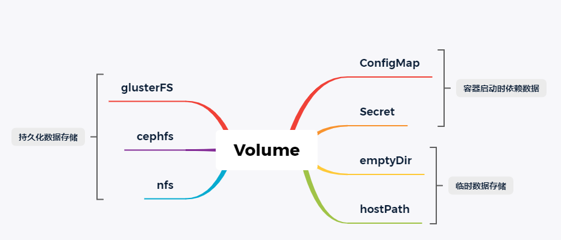

# K8S-存储



## Secret

用于存储用户名密码、认证证书等敏感信息, 是一种Volume机制。

secret 类型：

- docker-registry (访问docker仓库的密码，通过spec.imagePullSecrets加载)
- generic  (可自定义 key / value)
- tls （可存放 HTTPS 证书等）

```shell
kubectl create secret --help
#Available Commands:
#  docker-registry :docker仓库准备的秘钥
#  generic         ：普通秘钥
#  tls             ：tls
#Usage:
#  kubectl create secret [flags] [options]

# 从文件创建Secret
kubectl create secret generic mysql-secret --from-file=./username.txt --from-file=./password.txt
# 从字符串创建
kubectl create secret generic mysql-secret –from-literal=username=admin –from-literal=password=123456
# 通过yaml文件创建，如使用下面 -o yaml 输出的yaml文件
# 内容为了安全性不能写明文使用 echo -n 'admin' | base64 转base64编码

# 修改secret
kubectl edit secret mysql-secret

kubectl get secret mysql-secret -o yaml

apiVersion: v1
data:
  password.txt: MTIzNDU2
  username.txt: YWRtaW4=
kind: Secret
metadata:
  creationTimestamp: "2020-07-19T12:38:41Z"
  name: db-user-passwd
  namespace: default
  resourceVersion: "636652"
  selfLink: /api/v1/namespaces/default/secrets/db-user-passwd
  uid: 06bd8f7e-689c-43c5-8a2b-481c843cb7cc
type: Opaque	# 隐藏不显示
```

secret使用：

+ 通过环境变量的方式使用

  ```shell
  kubectl explain pod.spec.containers.env
  
  spec:
    containers:
      env:
        - name: SECRET_USERNAME	# 环境变量的名字
          valueFrom:				# 取值来源
            secretKeyRef:			# 表示从secret取值
              name: mysql-secret	# 
              key: username.txt
        - name: SECRET_PASSWORD
          valueFrom:
            secretKeyRef:
              name: mysql-secret
              key: password.txt
  ```

+ 通过volume的形式挂载到pod的某个目录

  ```yaml
  apiVersion: v1
  kind: Pod
  metadata:
    name: mypod-secret-2
  spec:
    containers:
    - name: nginx
      image: nginx
      volumeMounts:
      - name: foo
        mountPath: "/etc/foo"	#容器内挂载路径
        readOnly: true
    volumes:
    - name: foo
      secret:
        secretName: mysecret
  ```

## ConfigMap

用来挂载配置，对数据保密性要求不高，可以看到配置内容。

ConfigMap类似微服务系统中的配置中心。可以实现热更新。

> secret和ConfigMap的数据都是保存在Master节点的etcd集群中。
>
> 对比docker volume是将数据存储在宿主机，然后挂载到容器内部某目录。

```shell
# 查看ConfigMap
kubectl get cm
```

创建ConfigMap

+ 通过命令行＋文件创建
+ 通过yaml配置创建

引用ConfigMap

+ volumes 挂载（支持热更新[基于ApiServer的内容事件订阅机制实现]，常用方式）
+ 环境变量方式导入（不支持热更新）

## EmptyDir

类似Docker的匿名卷；将容器内部的文件挂载到宿主机的临时目录。EmptyDir与Pod的生命周期一致。

使用场景：

+ 临时存储（存储中间数据）
+ 容器共享存储（容器协同）

## HostPath

将宿主机文件挂载到容器中。

```yaml
apiVersion: v1
kind: Pod
metadata:
  name: test-pd-hostpath
spec:
  containers:
  - image: tomcat:7
    name: test-container
    
    volumeMounts:
    - mountPath: /test-pd
      name: test-volume
  volumes:
  - name: test-volume
    hostPath:
      # directory location on host
      path: /var/lib/docker
      # this field is optional
      type: Directory
```

特权容器。

## 持久化存储

### NFS服务

原理：CS架构，Server上安装nfs-utils创建共享目录以及访问权限并配置开放出去。Client端只需要安装 nfs-utils。

```shell
#配置NFS服务
yum install -y nfs-utils	#Master Node都要安装
# 创建共享目录
mkdir -p /data/volumes
#执行命令 vi /etc/exports，创建 exports 文件，文件内容如下：
echo "/data/volumes/ *(insecure,rw,sync,no_root_squash)" > /etc/exports
#执行以下命令，启动 nfs 服务
systemctl enable rpcbind
systemctl enable nfs-server
systemctl start rpcbind
systemctl start nfs-server
systemctl status rpcbind
systemctl status nfs-server
exportfs -r
#检查配置是否生效
exportfs
# 输出结果如下所示
/data/volumes <world>
```

原生挂载（指定nfs-server ip、volume path）

```yaml
# K8S volume挂载支持NFS?
apiVersion: v1
kind: Pod
metadata:
  name: vol-nfs
  namespace: default
spec:
  volumes:
  - name: html
    nfs:
      path: /data/volumes   #1000G
      server: 192.168.2.181		#Master节点上运行nfs-server,此pod运行在Node节点
  containers:
  - name: myapp
    image: nginx
    volumeMounts:
    - name: html
      mountPath: /usr/share/nginx/html/		#将Master的/data/volumes挂载到Node的/usr/share/nginx/html/	
```

测试:

在Master节点的/data/volumes下创建index.html, 然后curl访问Nginx服务器。

```shell
#执行以下命令检查 nfs 服务器端是否有设置共享目录
# showmount -e $(nfs服务器的IP)
showmount -e 192.168.2.181
# 输出结果如下所示
Export list for 192.168.2.181
/data/volumes *

#执行以下命令挂载 nfs 服务器上的共享目录到本机路径 /root/nfsmount
mkdir /root/nfsmount
# mount -t nfs $(nfs服务器的IP):/root/nfs_root /root/nfsmount
#高可用备份的方式
mount -t nfs 1192.168.2.181:/data/volumes /root/nfsmount
#Node上写入一个测试文件
echo "hello nfs server" > /root/nfsmount/test.txt
#在 nfs 服务器上执行以下命令，验证文件写入成功
cat /data/volumes/test.txt
```


### PV(persistentVolume)

### PVC(persistentVolumeClaim)

### Provisioning

### Storage Classes

"reclaim policy"有三种方式：Retain、Recycle、Deleted。

+ Retain
  保护被PVC释放的PV及其上数据，并将PV状态改成"released"，不将被其它PVC绑定。集群管理员手动通过如下步骤释放存储资源：
  手动删除PV，但与其相关的后端存储资源如(AWS EBS, GCE PD, Azure Disk, or Cinder volume)仍然存在。
  手动清空后端存储volume上的数据。
  手动删除后端存储volume，或者重复使用后端volume，为其创建新的PV。

+ Delete
  删除被PVC释放的PV及其后端存储volume。对于动态PV其"reclaim policy"继承自其"storage class"，
  默认是Delete。集群管理员负责将"storage class"的"reclaim policy"设置成用户期望的形式，否则需要用
  户手动为创建后的动态PV编辑"reclaim policy"

+ Recycle
  保留PV，但清空其上数据，已废弃

### 静态提供PV

### 动态提供PV

PV可以随着PVC的创建／删除自动创建／删除。


前提前面NFS环境已经搭好。

+ 创建授权，绑定角色，并为provisioner设置角色（然后provisioner就可以创建PV了）。

+ 创建StorageClass

+ 改变默认SC

  ```shell
  kubectl patch storageclass storage-nfs -p '{"metadata": {"annotations":{"storageclass.kubernetes.io/is-default-class":"true"}}}'
  ```

+ 创建PVC

+ 使用PVC