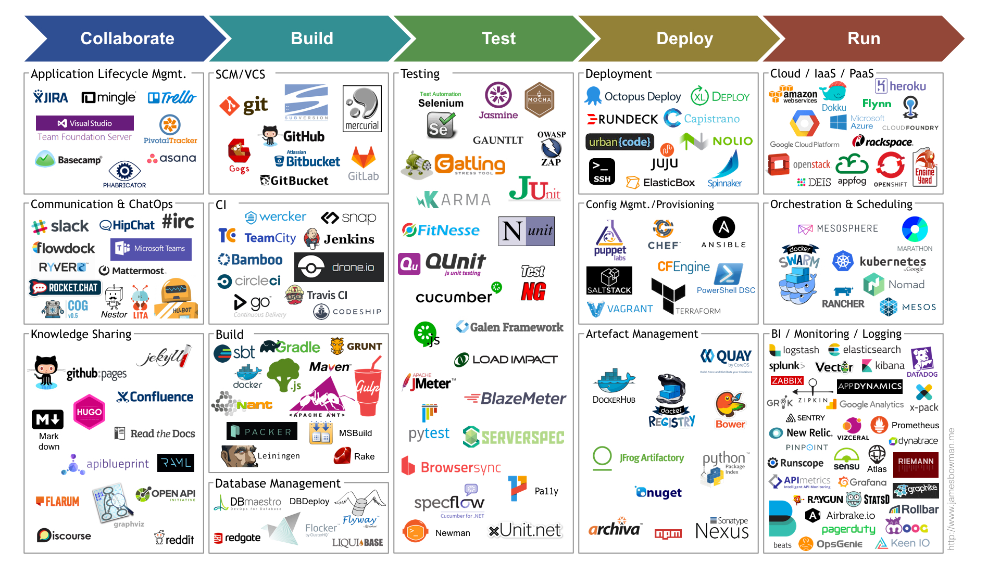
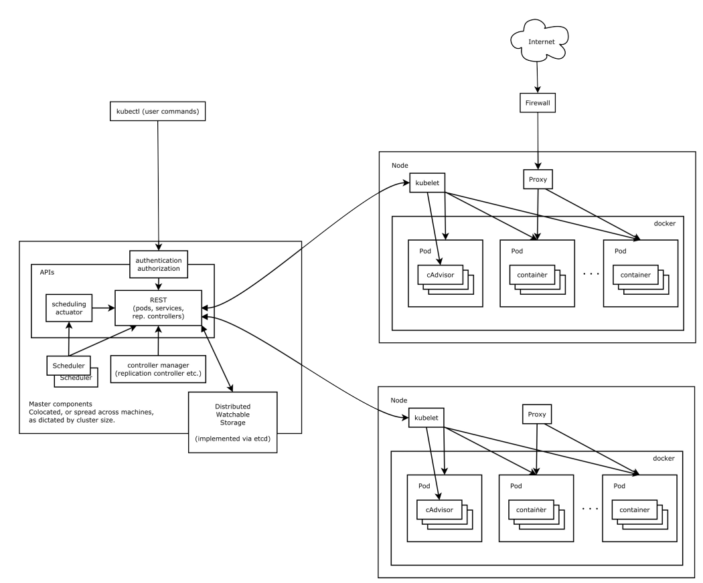

# K8S架构与原理

**项目开发部署运维流程**：

## K8S vs SpringCloud

**微服务系统架构**：

**微服务的组件**：

[K8S](https://kubernetes.io/zh/docs/home/)

[Spring Cloud](https://spring.io/projects/spring-cloud)

|                | K8S            | Spring Cloud            |
| -------------- | -------------- | ----------------------- |
| 消息总线       | ／             | Bus                     |
| 配置中心       | ConfigMap      | Config                  |
| 服务注册与发现 | Service        | Eureka/Consul/Zookeeper |
| 网关           | Ingress        | Gateway                 |
| 链路追踪       | 可整合         | Sleuth                  |
| 熔断与降级     | RS/RC可实现HPA | Circuit Breaker         |
| 远程调用       | 可整合         | Feign                   |
| 负载均衡       | Service        | Rabbion                 |
| 服务自动恢复   | Deployment     | ／                      |
| ...            | ...            | ...                     |

K8S优缺：

微服务系统中常用功能K8S组件都已经实现，同时可以使用Helm Chart以Pod的形式快速整合其他组件拓展功能。

Spring Cloud优缺

提供了微服务一站式解决方案，组件齐全；但是缺乏自动运维的能力。

也有见K8S和Spring Cloud结合使用的。

## K8S架构与组件简析

**提供的主要功能**：

+ 服务发现和负载均衡

+ 存储编排

+ 自动部署和回滚

+ 自动二进制打包

  可以指定每个容器所需 CPU 和内存（RAM）

+ 自我修复

+ 密钥与配置管理

**K8S架构图**：

**组件说明**：

+ **Master**

  + **API Server**

    主节点上负责提供 Kubernetes API 服务的组件；如执行`kubectl get all`就是由API Server解析执行。

    创建服务资源(Service、Pod等)用的yaml文件中的配置都对应着API操作接口。

  + **Scheduler**

    用于Pod调度到哪个Node上执行。

  + **Controller**

    + **Replication [RC]**(不常用)

      Pod副本控制器。

    + **ReplicaSet [RS]**（不常用）

      RS是RC的升级版，支持复杂的选择器。

    + **Deployment**(常用)

      Deployment是RS的升级版, 除了副本控制还可以定义升级策略，升级版本记录等。

    + **StatefulSet**

      有状态服务。

    + **DaemonSet**

      定义每个Node都会部署的Pod。

    + **Job**

      一次性任务。

    + **CronJob**

      定时任务。

  + **etcd**

    兼具一致性和高可用性的键值数据库，作为保存 Kubernetes 所有集群数据的后台数据库。

    如网络配置、资源限定、资源分配情况。

+ **Node**

  + **Pod**

    Docker容器集合。

  + **Docker**

  + **Kubelet**

    用于管理Pod,确保Pod容器运行状态健康。

  + **Kube-proxy**

    集群中每个节点上运行的网络代理。通过Kube-proxy与外部通信。

  + **Fluentd**

    集群节点运行日志收集。

## K8S业内最佳实现方案

### 企业生产中构建K8S微服务

+ **yaml**

+ **Helm**

+ **KubeSphere**

  

### K8S微服务最佳实现

#### 原生方式

##### 1) 开发到Docker镜像构建

##### 2) 写API资源配置Yaml并应用

##### 3) 使用Helm安装其他拓展插件

##### 4) 后续配置

#### KubeSphere

##### 1) 多租户管理

##### 2) 

##### 2)

##### 2)

##### 2)