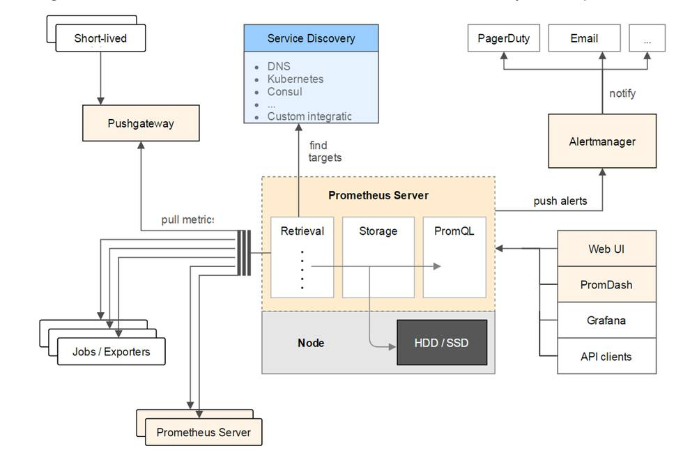

# K8S搭建日志和监控系统

## 日志系统

+ ELK

## 监控系统

### 主要监控方式

+ **健康检查** healthcheck

  如：ping。

+ **系统运行指标**（CPU、Memory、QPS）
  如：metrics。

+ **日志** logging

+ **链路追踪** tracing

  如：sleuth+zipkin, skywalking。

### 监控方案

#### Prometheus + Grafana

##### Promethus工作原理



+ Prometheus是通过拉的方式获取监控数据。

+ Short-lived + Pushgateway

  短时任务不可能让Prometheus服务器一直拉数据，所以中间对接一个Pushgateway，短时任务将监控数据推到Pushgateway，PrometheusServer再从Pushgateway拉取。

+ Exporters

  是针对第三方应用用于获取应用运行指标的工具。

+ Retrieval

  用于获取监控数据源位置

+ Storage

  存储监控数据，分段存储；较新的数据存内存。

+ PromQL

  数据查询接口，对接监控UI工具可以做界面展示。

+ AlertManager

  报警接口。、

##### 安装Prometheus

```shell
helm install prometheus apphub/prometheus
# 为了方便查看默认的监控页面，将网络类型(spec.type)改为NodePort
kubectl edit svc prometheus-server
```

##### 安装Grafana

```shell

```

grafana模板库

