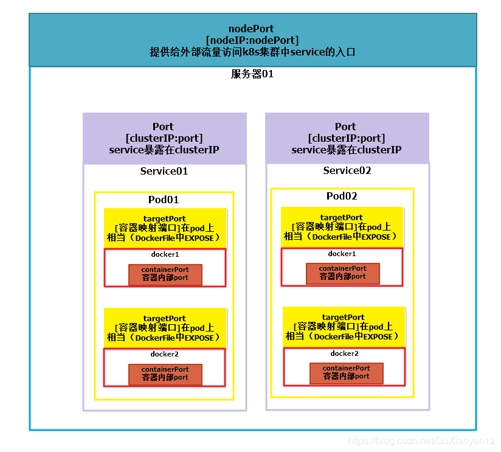

# K8S疑问

+ metadata: labels \ selector:matchLabels \ template:metadata:lables 的关系？

+ Service Pod Deployment 端口号的关系？

  

+ Service是不是依赖Calico等网络插件实现负载均衡的？

+ deployment部署的一个pod有多个tomcat容器如何修改端口映射防止冲突？

