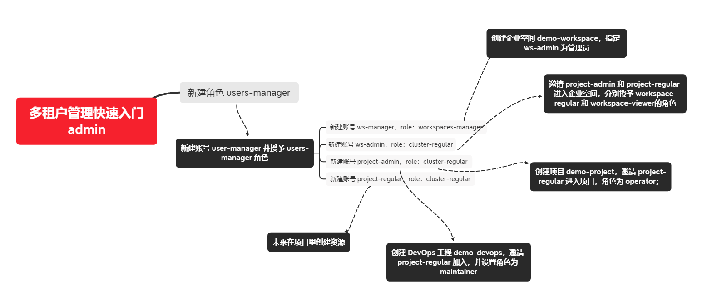

# 多租户管理


cluster指的是整个公司的资源；

workspace用于某个项目组；

project / devops project 是项目组的某个项目（一个项目通常对应一个namespace）。



切换为ws-manager，创建企业空间demo-workspace,邀请ws-admin用户为管理员。

切换为ws-admin，邀请project-admin用户为worksapce-regular, 邀请project-regular用户为workspace-viewer。

切换为project-admin用户,创建项目。

> 资源型项目：
>
> 每一个资源型项目都对应一个k8s的namespace。是公司的项目应用资源集合。
>
> DevOps工程：
>
> DevOps工程只负责CI/CD,自动化测试。

创建资源型项目后可以查看到多了一个命名空间

```shell
[root@ks-allinone ~]# kubectl get namespace -A
NAME                           STATUS   AGE		
default                        Active   45h
demo-project                   Active   103s	# 资源型项目的命名空间
kube-node-lease                Active   45h
kube-public                    Active   45h
kube-system                    Active   45h
kubesphere-controls-system     Active   44h
kubesphere-devops-system       Active   28h
kubesphere-monitoring-system   Active   44h
kubesphere-system              Active   44h
```

